# 说明

重磅发布：墨奇音形，支持自然码、小鹤、搜狗、微软双拼。墨奇音形是一个基于字形描述信息、递归拆分，最后取首末双形音托的码表开源的方案。详见[墨奇码拆分规则](https://github.com/gaboolic/rime-shuangpin-fuzhuma/wiki/%E5%A2%A8%E5%A5%87%E7%A0%81%E6%8B%86%E5%88%86%E8%A7%84%E5%88%99)。[墨奇码](https://github.com/gaboolic/moqima-tables)的拆分码表已开源，目前已经拆分完成全部的通用规范汉字、常用繁体字，总计支持4万字。墨奇音形的方案支持ctrl+p开关显示墨奇辅助码+首末字形，ctrl+l开关显示墨奇拆字的拆分。

在线试用：[墨奇音形顶屏版](https://my-rime.vercel.app/?plum=gaboolic/rime-shuangpin-fuzhuma@master:moqi_single_xh)

[墨奇音形大词库版](https://my-rime.vercel.app/?plum=gaboolic/rime-shuangpin-fuzhuma@master:moqi_xh,moqi_zrm) (词库多，加载较慢)

- [此仓库](https://github.com/gaboolic/rime-shuangpin-fuzhuma)为rime配置文件,词库使用最强简体词库——[雾凇拼音](https://github.com/iDvel/rime-ice)，在雾凇拼音的基础上实现自然码双拼、小鹤双拼，以及对应的辅助码。本人用的是这个方案，所以更新有保证。
- 配置文件参考[小鹤双拼+自然快手/小鹤双形辅助码](https://github.com/functoreality/rime-flypy-zrmfast)
- [魔改自然碼 Rime 方案 (自然碼雙拼+輔助碼+外語混輸+簡繁方案+emoji)](https://github.com/ksqsf/rime-moran)
- 主要配置文件:
  - `moqi_xh.schema.yaml # 墨奇音形鹤拼版`
  - `moqi_zrm.schema.yaml # 墨奇音形自然码双拼版`
  - `flypy_flypy.schema.yaml # 小鹤双拼+鹤形辅助码`
  - `zrm_zrm.schema.yaml # 自然码双拼+自然码辅助码`
- 词库文件分别为`moqi.extended.dict.yaml`（墨奇音形）、`flypy_flypy.extended.dict.yaml`（鹤拼鹤形）和`zrm_zrm.extended.dict.yaml`（自然码拼+自然码部首辅），默认只开启了我用[雾凇词库](https://github.com/iDvel/rime-ice)转换的词典文件。此外还有从其他地方获取的细胞词库，例如历史类、地名类、古诗文、计算机、动漫、电影、游戏、电商等，可自行打开注释或从[细胞词库](https://github.com/Bambooin/rimerc/tree/master/luna_pinyin)获取。如无特殊需求，词典文件只配置词即可，rime引擎会自动计算编码。
- 注意：默认关了用户词库（为了固定词频），如有需要，修改`你使用的方案.schema.yaml enable_user_dict: true`开启
- 默认固定词频，编辑`cn_dicts_common/user.dict.yaml`来添加自定义的词；推荐在用户词库关闭的情况下使用ac引导造词，这样自造词是在系统词库后面，不会影响系统词的字频和词序。
- 默认显示单字的辅助码编码，可在`你使用的方案.schema.yaml`中`translator/spelling_hints`调整为更多或不显示
- 超级简拼：2码、3码时，按下Tab（手机上是/）自动上屏2字词、3字词，不和空格上屏的单字冲突。
- 三字词，用e引导简码，简码取声母，如：阿波罗 eabl,差不多 eibd,巴不得 ebbd。
- 四字词、多字词，用e引导简码，简码取前3个字+末字声母，如：兵败如山倒 ebbrd,霸王硬上弓 ebwyg,天有不测风云 etyby,当仁不让 edrbr
- `changcijian`、`changcijian3`文件是自动从雾凇词库里取的

### FAQ（常见问题）q羣696353204

  更多配置及功能请看：[FAQ.md](md/FAQ.md)

### 输入效果

- 整句输入插入字辅：

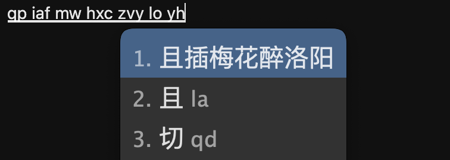

- 打词时插入辅助码：

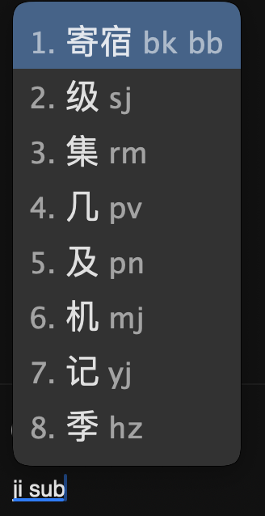

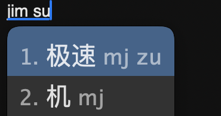

- 整句输入时增强单字性能，增加syffo或者syff/ 5码上屏单字的功能


- 不认识的字可以笔画输入 `ab`引导 hspnz横竖撇捺折

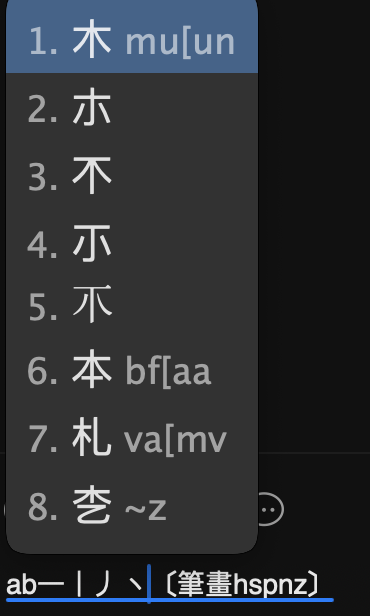

- 也可以部件组字输入 `az`引导


- 也可以输入仓颉码 `acj`引导


- 通过opencc支持繁简转换、火星文、首末拆分字形(墨奇音形)

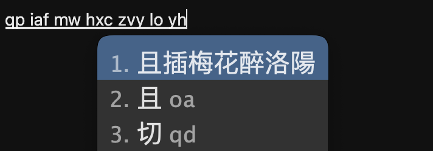

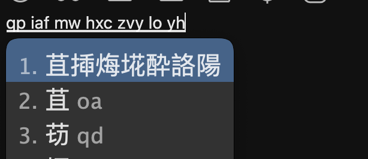

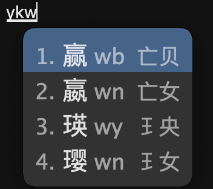

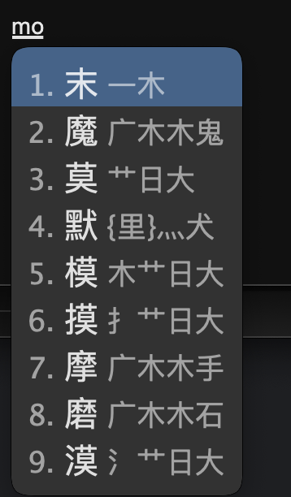

- 超级简拼：2码、3码时，按下Tab（手机上是/）自动上屏2字词、3字词，不和空格上屏的单字冲突


墨奇音形的方案支持ctrl+p开关显示墨奇辅助码+首末字形,ctrl+l开关显示墨奇拆字的拆分

- 日期时间相关输入：`date time week` `datetime` `timestamp`

  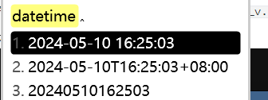

- 快捷日期输入：N开头

  - 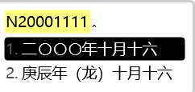

- 符号输入`/fh`，更多符号查看`symbols_caps_v.yaml`

  - 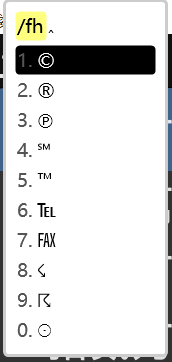

- 大写数字：`R开头`
  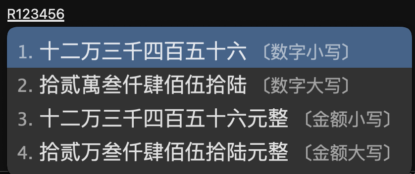

- 直接输入unicode：U开头
  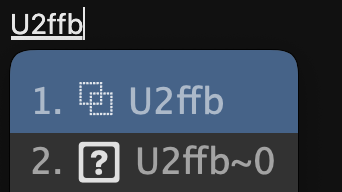

- 计算器功能(V模式) 感谢[ChaosAlphard](https://github.com/ChaosAlphard)的[pr](https://github.com/gaboolic/rime-shuangpin-fuzhuma/pull/41)
  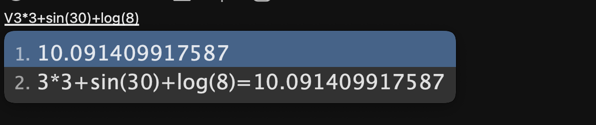

  - [计算器功能介绍](md/calc.md)
  - 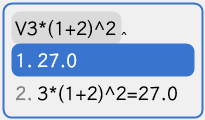
  
- 英文输入：aw开头

  - 

- 日文输入：aj开头

  - 

- 翻译功能：ctrl + E开启英汉、汉英互译。
  
  - 
  - 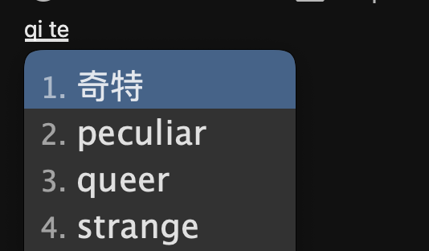

- O符快符：o开头，快速输入各种符号偏旁部件，可以参考[快符](md/fuhao.md)      [部件](md/bujian.md)

  - 
  - 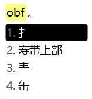

- 分号符：

  - 因为实现分号符后，分号无法自动上屏，如果希望能使用分号符，可以进行以下操作 [分号符](md/fenhaofu.md)

### 配置文件路径

- windows %APPDATA%\Rime
- mac ~/Library/Rime
- linux ~/.local/share/fcitx5/rime
- android <https://github.com/fcitx5-android/fcitx5-android> /Android/adata/org.fcitx.fcitx5.android/files/data/rime

推荐直接用git管理配置，首次：例如mac可以打开~/Library文件夹，然后`git clone --depth 1 https://github.com/gaboolic/rime-shuangpin-fuzhuma Rime`  后面在Rime文件夹执行`git pull`即可

### 飞键 模糊音相关

```
# `你使用的方案.shema.yaml` 里飞键 可选择性开启
- derive/^([yh])j/$1q/    # yj hj就可以打yq hq
- derive/^qx/qw/  # qx就可以打qw
模糊音同理，也是使用derive把平舌音翘舌音互转、前后鼻音互转，详见issue中的faq
```

### 并击相关

- [并击原理](https://github.com/gaboolic/rime-shuangpin-fuzhuma/wiki/%E5%B9%B6%E5%87%BB%E5%8E%9F%E7%90%86)

### todo

```
出简让全码表优化

墨奇音形自然码下 e简码问题修复

墨奇音形自动上屏版，4码为词，4码+/自动上屏单字，a-z顶词

自动上屏的lua，例如ow os syff/

字典功能，反查时生僻字显示读音和释义

引入东风破管理

英文模糊输入的lua，例如输入be*ful得到beautiful

emoji的词库 支持双拼

两分和部件组字的码表统一，在自然码下用自然码 在小鹤下用小鹤

置顶词、删除词

```

### 鸣谢

雾凇词库 <https://github.com/iDvel/rime-ice> 白霜词库 <https://github.com/gaboolic/rime-frost>

墨奇码码表 <https://github.com/gaboolic/moqima-tables>

小鹤双拼+辅助码 <https://gitee.com/functoreality/rime-flypy-zrmfast>

魔然（自然码双拼辅助码）：<https://github.com/ksqsf/rime-moran>

细胞词库&各个发行版配置 <https://github.com/Bambooin/rimerc>

az部件组字模式使用的词典 <https://github.com/mirtlecn/rime-radical-pinyin>

声笔输入法 <https://github.com/sbsrf/sbsrf>

星空键道：<https://github.com/xkinput/Rime_JD>

英汉/汉英字典 <https://github.com/lxs602/Chinese-Mandarin-Dictionaries>

墨奇本猫：


## Star History

[](https://star-history.com/#gaboolic/rime-shuangpin-fuzhuma&Date)
