# V键简易计算器说明

默认触发键`V`，可在`<方案名>.schema.yaml`文件里的`calculator/trigger`选项里自行修改触发键

## 基础功能

### `+ - * / % ^`

  
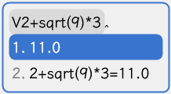

### `e`

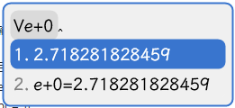

### `π`

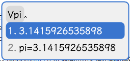

## 进阶功能

正弦、余弦、正切、平方根、弧度转度、度转弧度、对数等计算支持

### 阶乘

支持 `x!` 或者 `fact(x)` 两种调用方式，`x!`调用方式只支持在数字后调用，不支持`sqrt(2)!`形式调用  
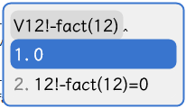

若要实现类似`sqrt(2)!`的效果，需使用`fact(x)`调用方式  
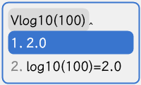

由于代码实现方式原因，`x!`拥有在计算中高优先级，请注意  
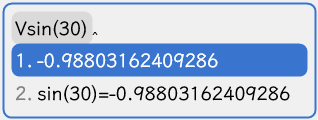

### 正弦

`sin(x)`  
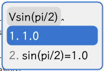

### 双曲正弦

`sinh(x)`  
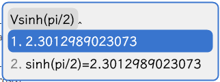

### 反正弦

`asin(x)`  

### 余弦

`cos(x)`  
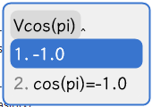

### 双曲余弦

`cosh(x)`  
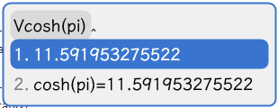

### 反余弦

`acos(x)`  

### 正切

`tan(x)`  
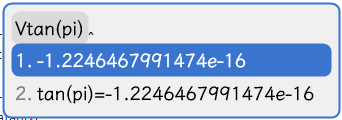

### 双曲正切

`tanh(x)`  
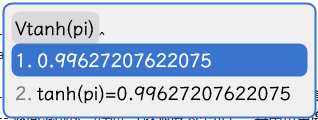

### 反正切
>
> atan(y/x) = atan2(y, x)

`atan(x)`  
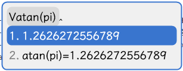

`atan2(y, x)`  
与atan(y/x)相比，能够正确处理边界情况（例如x=0）  
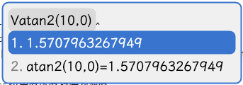

### 将角度从弧度转换为度

`deg(x)`  
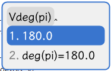

### 将角度从度转换为弧度

`rad(x)`  
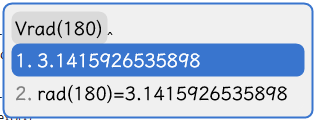

### 平方根

`sqrt(x)`  
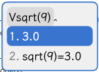

### 对数

`log(y, x)`，y为底x的对数，即 $\log_{y}(x)$

`loge(x)`，e为底x的对数，即 $\log_{e}(x)$

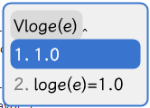

`log10(x)`，10为底x的对数，即 $\log_{10}(x)$

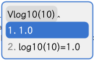

## 拓展功能

### 随机数

`rdm([m [,n ]])`，返回m-n之间的随机数，n为空则返回1-m之间，都为空则返回0-1之间的小数

### `x`乘以2的指定次幂

`ldexp(x, y)` = $x \times 2^y$

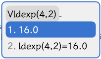

### `e`的`x`次方

`exp(x)` = $e^x$

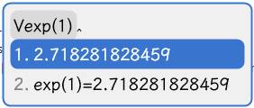

### 平均值

`avg(...)`

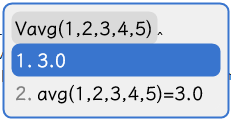

### 方差

`var(...)`

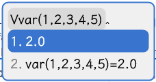
