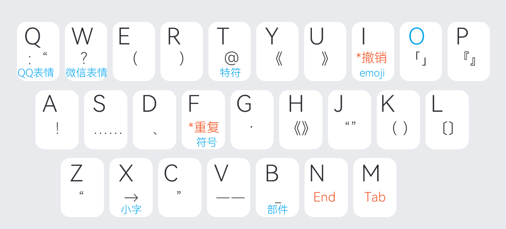

# 符号

**一、快符、O符**

- **分号键**：引导快符及特殊功能，双击上屏本身
  `;a` 输出感叹号！（其它符号输出类推）
  `;i` 撤销上屏词条，安卓版为`♪`键+空格
  `;f` 重复上屏词条
  `;n` 模拟 `End` 键，可用于光标移出成对符号

> - 号表示最后上屏的编码或字词，即输出内容后再使用此组合
>   如不需要此功能，可进 `ogj2` ，删除“上屏引导键=;”后面的分号

- **O** 键：引导符号数字等其它符号编码
  `ob` 引导部件字根列表，如：`oba` 则显示 a 字母上的部件字根
  `ox` 引导小字字根列表，如：`oxa` 则显示 a 字母上的小字字根
  `of` 引导成组符号（编码见二）安卓版为 上划 `z` 键
  `ot` 引导特殊符号（编码见三）
  `oq` 引导QQ表情，如：`oqcy`上屏 
  `ow` 引导微信表情，如：`owwx` [微笑]
  `oi` 引导emoji表情，如：`oixk`　😂

**二、成组符号**
`of` 引导符号组（安卓版为上划 `z` 键引导）

| 名称               | 编码 | 符号列表                                                     |
| :----------------- | :--- | :----------------------------------------------------------- |
| 圆圈数字           | ofyu | ① ② ③ ④ ⑤ ⑥ ⑦ ⑧ ⑨ ⑩                                          |
| 括号数字           | ofku | ⑴ ⑵ ⑶ ⑷ ⑸ ⑹ ⑺ ⑻ ⑼ ⑽ ⑾ ⑿ ⒀ ⒁ ⒂ ⒃ ⒄ ⒅ ⒆ ⒇                      |
| 点数字             | ofdu | ⒈ ⒉ ⒊ ⒋ ⒌ ⒍ ⒎ ⒏ ⒐ ⒑ ⒒ ⒓ ⒔ ⒕ ⒖ ⒗ ⒘ ⒙ ⒚ ⒛                      |
| 中文数字           | ofvu | ㈠ ㈡ ㈢ ㈣ ㈤ ㈥ ㈦ ㈧ ㈨ ㈩                                |
| 罗马大写           | ofld | Ⅰ Ⅱ Ⅲ Ⅳ Ⅴ Ⅵ Ⅶ Ⅷ Ⅸ Ⅹ Ⅺ Ⅻ                                      |
| 罗马小写           | oflx | ⅰ ⅱ ⅲ ⅳ ⅴ ⅵ ⅶ ⅷ ⅸ ⅹ                                          |
| 上标符号           | ofub | ¹ ² ³ ⁴ ⁵ ⁶ ⁷ ⁸ ⁹ ⁰ ⁺ ⁻ ⁼ ⁽ ⁾ ⁿ ˣ                            |
| 下标符号           | ofxb | ₁ ₂ ₃ ₄ ₅ ₆ ₇ ₈ ₉ ₀ ₊ ₋ ₌ ₍ ₎ ₙ ₓ                            |
| 单位符号           | ofdw | ㎎ ㎏ ㎜ ㎝ ㎞ ㎡ nm μm μg ㏄ ㏎ ㏑ ㏒ ㏕                    |
| 结构符号           | ofjg | ⿰ ⿱ ⿲ ⿳ ⿴ ⿵ ⿶ ⿷ ⿸ ⿹ ⿺ ⿻                          |
| 货币符号           | ofhb | € $ ￠ £ ￡ ¥ ฿                                              |
| 箭头符号           | ofjt | ← → ↑ ↓ ↗ ↙ ↘ ↖ ↔ ↕                                          |
| 制表符号           | ofvb | ┌ └ ┐ ┘ ─ │ ├ ┤ ┬ ┴ ┼ ┏ ┗ ┓ ┛ ━ ┃ ┣ ┫ ┳ ┻ ╋                  |
| 数学符号           | ofux | ＋ － ＜ ＝ ＞ ± × ÷ ∈ ∏ ∑ ∕ √ ∝ ∞ ∟ ∠ ∣ ∥ ∧ ∨ ∩ ∪ ∫ ∮ ∴ ∵ ∶ ∷ ∽ ≈ ≌ ≒ ≠ ≡ ≤ ≥ ≦ ≧ ≮ ≯ ⊕ ⊙ ⊥ ⊿ |
| 标点符号           | ofbd | “” （） 《》 〈〉 〔〕 「」 『』 【】 〖〗［］ ｛｝ ． 。 ， 、 ； ： ？ ！ … — · ˉ ˇ ¨ 々 ～ ‖ ∶ ＂ ＇ ｀ ｜ |
| 注音符号           | ofvy | ㄅ ㄆ ㄇ ㄈ ㄉ ㄊ ㄋ ㄌ ㄍ ㄎ ㄏ ㄐ ㄑ ㄒ ㄓ ㄔ ㄕ ㄖ ㄗ ㄘ ㄙ ㄧ ㄨ ㄩ ㄚ ㄛ ㄜ ㄝ ㄞ ㄟ ㄠ ㄡ ㄢ ㄣ ㄤ ㄥ ㄦ |
| 特殊符号           | oftu | ℃ ° ‰ ♂ ♀ § № ☆ ★ ○ ● ◎ ◇ ◆ □ ■ △ ▲ ※ 〓 ＃ ＆ ＠ ＼ ＾ ＿ ￣ |
| 拼音字母           | ofpy | ā á ǎ à ō ó ǒ ò ê ē é ě è ī í ǐ ì ǖ ǘ ǚ ǜ ü ū ú ǔ ù          |
| 偏旁部首           | ofpp | 勹 灬 冫 艹 屮 辶 刂 匚 阝 廾 丨 虍 彐 卩 钅 冂 冖 宀 疒 肀 丿 攵 凵 犭 亻 彡 饣 礻 扌 氵 纟 亠 囗 忄 讠 衤 廴 尢 夂 丶 丬 |
| 希腊大写           | ofxd | Α Β Γ Δ Ε Ζ Η Θ Ι Κ Λ Μ Ν Ξ Ο Π Ρ Σ Τ Υ Φ Χ Ψ Ω              |
| 希腊小写           | ofxx | α β γ δ ε ζ η θ ι κ λ μ ν ξ ο π ρ σ τ υ φ χ ψ ω              |
| 俄文大写           | ofed | А Б В Г Д Е Ж З И Й К Л М Н О П Р С Т У Ф Х Ц Ч Ш Щ Ъ Ы Ь Э Ю Я Ё |
| 俄文小写           | ofex | а б в г д е ж з и й к л м н о п р с т у ф х ц ч ш щ ъ ы ь э ю я ё |
| （日文大写片假名） | ofrd | ァ ア ィ イ ゥ ウ ェ エ ォ オ カ ガ キ ギ ク グ ケ ゲ コ ゴ サ ザ シ ジ ス ズ セ ゼ ソ ゾ タ ダ チ ヂ ッ ツ ヅ テ デ ト ド ナ ニ ヌ ネ ノ ハ バ パ ヒ ビ ピ フ ブ プ ヘ ベ ペ ホ ボ ポ マ ミ ム メ モ ャ ヤ ュ ユ ョ ヨ ラ リ ル レ ロ ヮ ワ ヰ ヱ ヲ ン ヴ ヵ ヶ ー ヽ ヾ |
| （日文小写平假名） | ofrx | ぁ あ ぃ い ぅ う ぇ え ぉ お か が き ぎ ぱ く ぐ け げ こ ご さ ざ し じ す ず せ ぜ そ ぞ た だ ち ぢ っ つ づ て で と ど な に ぬ ね の は ば ひ び ぴ ふ ぶ ぷ へ べ ぺ ほ ぼ ぽ ま み む め も ゃ や ゅ ゆ ょ よ ら り る れ ろ ゎ わ ゐ ゑ を ん ゛ ゜ ゝ ゞ |

**三、特殊符号·圆圈数字**

| 编码 | 特殊符号   | 编码 | 特殊符号  | 编码 | 圆圈数字 |
| ---- | :--------- | ---- | :-------- | ---- | :------- |
| ota  | ＆ α       | otn  | ♂ ♀ №     | oyy  | ① Ⅰ      |
| otb  | © β        | oto  | € Ω       | oye  | ② Ⅱ      |
| otc  | ℃          | otp  | ㎡ π      | oys  | ③ Ⅲ      |
| otd  | ° = ≠ ≥ ＞ | otq  | ☰ ☷       | oyf  | ④ Ⅳ      |
| ote  | の ε       | otr  | ¥         | oyw  | ⑤ Ⅴ      |
| otf  | ′ Φ □ ■    | ots  | ∴ ∵ △ ▲   | oyl  | ⑥ Ⅵ      |
| otg  | √ γ        | ott  | ฿ ℡       | oyq  | ⑦ Ⅶ      |
| oth  | ℉ ※ ¤      | otu  | ϟ 囍 ™    | oyb  | ⑧ Ⅷ      |
| oti  | × ÷        | otv  | § ® ㈱    | oyj  | ⑨ Ⅸ      |
| otj  | ＋ －      | otw  | ‱ ∞ 卍 卐 | oyu  | ⑩ Ⅹ      |
| otk  | ♪ ␣        | otx  | ≤ ＜ ☆ ★  | -    | -        |
| otl  | m³         | oty  | £ ≈ ○ ●   | -    | -        |
| otm  | ″ μ ￠     | otz  | ← → ↑ ↓   | -    | -        |

#### [四、偏旁部首·汉语拼音](https://flypy.cc/#/fh?id=四、偏旁部首·汉语拼音)

| 编码 | 偏旁部首 | 编码 | 偏旁部首 | 编码 | 汉语拼音  |
| ---- | :------- | ---- | :------- | ---- | :-------- |
| opa  | 朿　㡀   | opn  | 㐄　屰   | oha  | ā á ǎ à   |
| opb  | 夋　夌   | opo  | 夅　夆   | oho  | ō ó ǒ ò   |
| opc  | 龷　卝   | opp  | 爫　𠂢   | ohe  | ē é ě è ê |
| opd  | 癶　弔   | opq  | 䒑　丂   | ohi  | ī í ǐ ì   |
| ope  | 㔾　卪   | opr  | 龰　疋   | ohu  | ū ú ǔ ù   |
| opf  | －       | ops  | 㒸　厽   | ohv  | ü ǖ ǘ ǚ ǜ |
| opg  | 厷　巠   | opt  | 龸　坴   | ohm  | ḿ m       |
| oph  | 巟　㐬   | opu  | 彡　㐱   | ohn  | ń ň ǹ     |
| opi  | 𡗗　镸   | opv  | 巛　冘   |      |           |
| opj  | 丬　丩   | opw  | 𠂉　𦈢   |      |           |
| opk  | 𠂤　彑   | opx  | 屮　襾   |      |           |
| opl  | 攴　歺   | opy  | 戉　肀   |      |           |
| opm  | 卂　丮   | opz  | 𠂔　𠦝   |      |           |

> 偏旁主要用于安卓版的组字功能